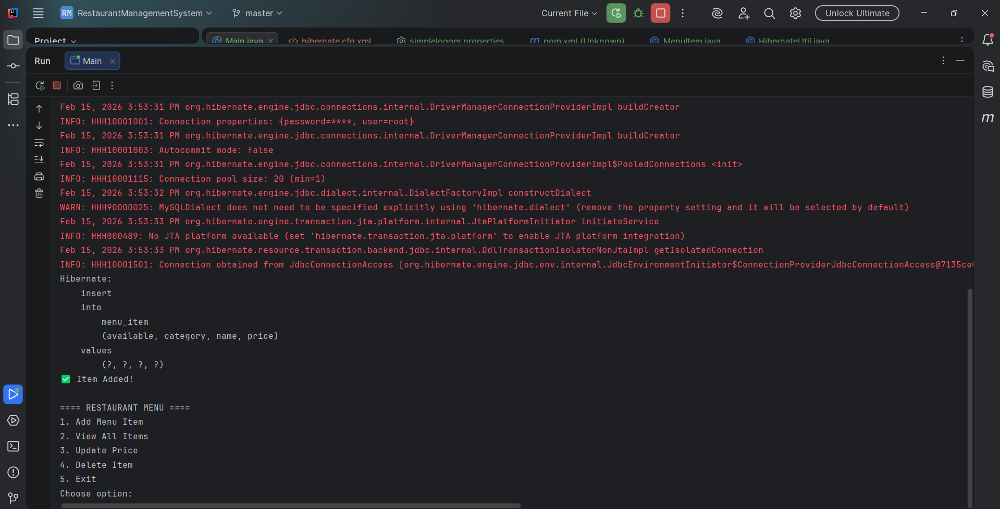
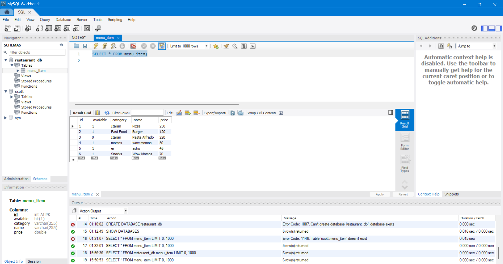

# Assessment 3 – Hibernate CRUD

## 📌 Objective
To develop a console-based **Restaurant Management System** using Hibernate ORM and MySQL.

---

## 📌 Application Features

✔ Add Menu Item  
✔ View All Items  
✔ Update Price  
✔ Delete Item  

---

## 📌 Database Table

**Table Name:** `menu_item`

**Fields:**

- id (Primary Key)
- name
- price
- category
- available

---

## 📌 Technologies Used

- Java
- Hibernate ORM
- MySQL
- Maven
- IntelliJ IDEA

---

## 📌 Hibernate Concepts Demonstrated

✔ Hibernate Configuration (`hibernate.cfg.xml`)  
✔ Entity Mapping using Annotations  
✔ SessionFactory Creation  
✔ Session Handling  
✔ Transaction Management  
✔ HQL Queries  
✔ Proper Resource Management  

---

## 📌 CRUD Operations Implemented

✔ Insert (Save Menu Item)  
✔ Read (Fetch using HQL)  
✔ Update (Modify price by ID)  
✔ Delete (Remove item by ID)  

---

## 📌 Configuration Details

✔ JDBC URL  
✔ Username / Password  
✔ Dialect  
✔ `hbm2ddl.auto = update`  
✔ `show_sql = true`  
✔ `format_sql = true`  

---

## 📸 Application Screenshots

### ✅ Console Menu

---

### ✅ Insert Operation

---

### ✅ MySQL Table Data

---

## ✅ Result
Application successfully performs **CRUD operations** using Hibernate ORM with MySQL database.

✔ All functionalities tested and verified successfully.
✔ Database operations executed correctly.

---

## 👨‍💻 Author
Ashutosh  
B.Tech CSE
